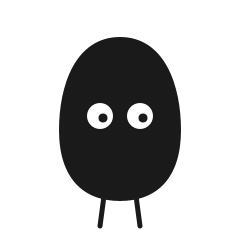
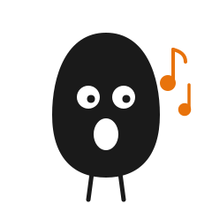
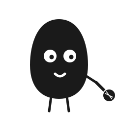
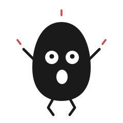
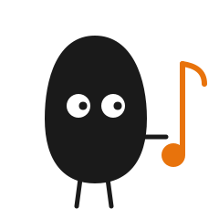

# 小黑形象图集

桌面宠物自带的一套「小黑」风格形象：黑色实心身体、白点眼、细腿、空表情，透明背景，浮在桌面上。点击桌宠时会在这几个动作之间循环切换。

> 图片为矢量 SVG，存放在 `assets/images/`。若某些 Markdown 阅读器不渲染 SVG，可用浏览器或编辑器（如 VS Code）打开本文件查看。

---

## 待机 · xiaohei_idle

平静站立，空表情。没点它的时候就是这副呆样。

---

## 张嘴唱 · xiaohei_sing

张大嘴，旁边飘出橙色音符——正在「唱」。点击播放音频时的状态最配它。

---

## 拿话筒 · xiaohei_mic

细胳膊伸出去握着话筒，认真开唱。歌手感最强的一版。

---

## 蹦跳 · xiaohei_bounce

双手举起、腿弯起来、头顶冒红色动感线——点击时的兴奋反馈。

---

## 看音符 · xiaohei_note

身体偏左，伸手指向一个大音符，眼睛朝右看。像在问「要听音乐吗」。

---

## 全家福

| 待机 | 张嘴唱 | 拿话筒 | 蹦跳 | 看音符 |
|------|--------|--------|------|--------|
|  |  |  |  |  |

---

## 画法要点（想自己改）

小黑这套全是手写 SVG，核心就四块：

- **身体**：一条略不规则的「黑豆」`path`，`fill="#1a1a1a"`。
- **白点眼**：两个白色 `circle`，再各点一个小黑点当瞳孔。
- **细腿**：两条 `stroke` 短线，`stroke-linecap="round"`。
- **透明背景**：不画底色，桌宠窗口透明，小黑就能干净地浮在桌面上。

加道具（音符 / 话筒 / 动感线）时用一点橙色 `#e8730c` 或红色 `#e23b3b` 点缀，其余保持黑白。换动作只改胳膊和腿的姿势即可。
